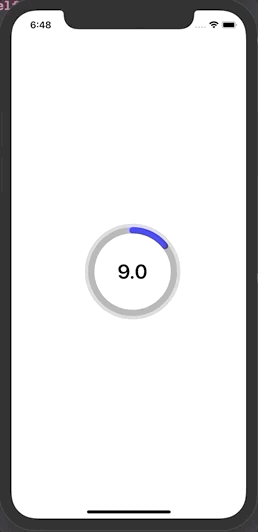

# Core Animation Practice
🧑🏻‍💻 Core Animation Practice

 

| 주차  |                             내용                             |                   설명                   |
| :---: | :----------------------------------------------------------: | :--------------------------------------: |
| 1번째 | [Custom Label Counting](https://github.com/dongminyoon/CoreAnimation_Prac/blob/main/CoreAnimation_Practice/CoreAnimation_Practice/CoreAnimationView/CountdownProgressBar.swift) | 원이 돌아가면서 카운팅을 할 수 있는 기능 |

 

---

### 실행화면

1. ***Custom Label Counting***

