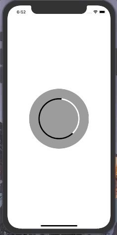
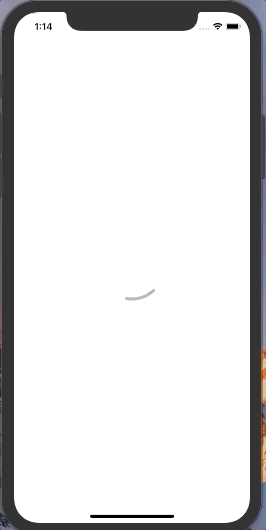
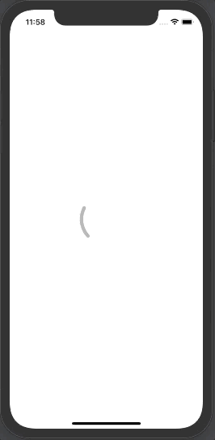
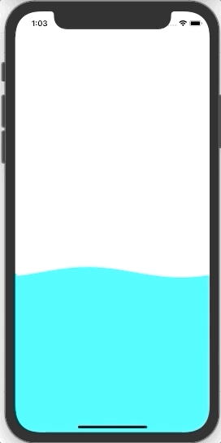
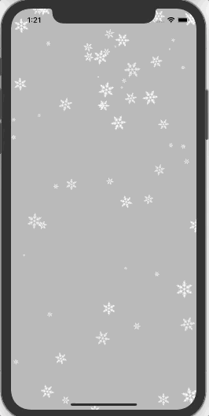
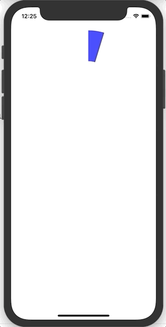

# Core Animation Practice

### 📕 개요

여러가지 ***Core Animation***의 예제를 구현해보는 레포지터리

---
### 🌟 목표
* 모든 iOS 앱 내의 UX적인 요소를 라이브러리를 사용하지 않고 구현할 수 있을때까지
* 만든 내용을 토대로 ***Cocoapod***s 오픈 소스 라이브러리 만들기

---
### ✏️ 주차별 내용
 

| 주차  |                             내용                             |                   설명                   |
| :---: | :----------------------------------------------------------: | :--------------------------------------: |
| 1번째 | [Custom Label Counting](https://github.com/dongminyoon/CoreAnimation_Prac/blob/main/CoreAnimation_Practice/CoreAnimation_Practice/CoreAnimationView/CountdownProgressBar.swift) | 원이 돌아가면서 카운팅을 할 수 있는 기능 |
| 2번째 | [Spinner Loading 1](https://github.com/dongminyoon/CoreAnimation_Prac/blob/main/CoreAnimation_Practice/CoreAnimation_Practice/CoreAnimationView/LoadingIndicator.swift) |     회전하는 로딩 창 - 일정하게      |
| 3번째 | [Spinner Loading 2](https://github.com/dongminyoon/CoreAnimation_Prac/blob/main/CoreAnimation_Practice/CoreAnimation_Practice/CoreAnimationView/LoadingIndicator2.swift) |              회전하는 로딩 창 - 가변적으로              |
| 4번째 | [Spinner Loading 3](https://github.com/dongminyoon/CoreAnimation_Prac/blob/main/CoreAnimation_Practice/CoreAnimation_Practice/CoreAnimationView/LoadingIndicator3.swift) | 회전하는 로딩 창 - 가변적으로 |
| 5번째 | [Wave](https://github.com/dongminyoon/CoreAnimation_Prac/blob/main/CoreAnimation_Practice/CoreAnimation_Practice/CoreAnimationView/CurveWave.swift) |              물결 치는 Wave              |
| 6번째 | [Snow Flake](https://github.com/dongminyoon/CoreAnimation_Prac/blob/main/CoreAnimation_Practice/CoreAnimation_Practice/CoreAnimationView/SnowlfakeView.swift) |              눈오는 화면              |
| 7번째 | [Pie Graph](https://github.com/dongminyoon/CoreAnimation_Prac/blob/main/CoreAnimation_Practice/CoreAnimation_Practice/CoreAnimationView/PieGraph.swift) |         Pie Graph 비율로 그리기          |

---

### 실행화면

1. ***Custom Label Counting***

 

2. ***Spinner Loading 1***

 

3. ***Spinner Loading 2***

 

4. ***Spinner Loading 3***

 

5. ***Wave***

 

6. ***Snow Flake***

7. ***Pie Graph***

 